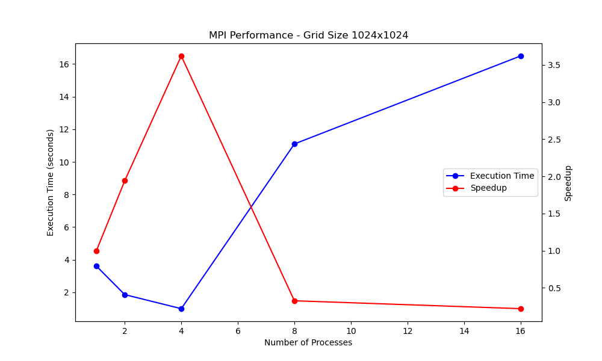

# Game of Life MPI Simulation

A parallel implementation of Conway’s Game of Life that distributes the grid across MPI ranks and exchanges halo rows each generation. The simulation entry point is [`main`](src/main.c), which orchestrates grid setup, communication, and timing by delegating to helpers such as [`game_of_life.c::evolve_mpi`](src/game_of_life.c) and [`grid.c::distribute_grid`](src/grid.c).

## Features

- Deterministic argument parsing and validation via [`utilities.c::parse_arguments`](src/utilities.c).
- Dynamic grid allocation with ghost rows for border exchange managed by [`grid.c::create_grid_local`](src/grid.c).
- Non-blocking halo swaps implemented in [`game_of_life.c::exchange_borders`](src/game_of_life.c) to keep communication overlapping.
- Progress reporting, robust MPI cleanup, and signal handling in [`src/main.c`](src/main.c).
- Benchmark script ([test.sh](test.sh)) for automated scaling studies and result plotting.

## Prerequisites

- C toolchain with MPI implementation (e.g., MPICH, OpenMPI) providing `mpicc` / `mpiexec` **and** the development headers (e.g., install `mpich` or `libopenmpi-dev` on Debian/Ubuntu so `mpi.h` resolves).
- GNU Make.
- Python 3 with `pandas` and `matplotlib` for plotting benchmarks:
  ```sh
  pip install pandas matplotlib
  ```

## Building

```sh
make
# artifacts: build/*.o, bin/game_of_life
```

Clean intermediate and binary files with:

```sh
make clean
```

## Running the Simulation

### Local execution

```sh
mpiexec -n 4 ./bin/game_of_life <generations> <grid_size>
# example
mpiexec -n 4 ./bin/game_of_life 1000 1024
```

The root rank reports statistics produced by [`utilities.c::print_stats`](src/utilities.c).

### Cluster execution

Provide a valid hostfile (e.g., [machines](machines)) and MPI will distribute ranks accordingly:

```sh
mpiexec -f machines -n 8 ./bin/game_of_life 500 2048
```

## Benchmark & Plot Workflow

1. Ensure `test.sh` is executable:
   ```sh
   chmod +x test.sh
   ```
2. Run the scaling study (prompts for cluster usage and optional plotting):
   ```sh
   ./test.sh
   ```
   Results accumulate in [test/results/mpi_performance.txt](test/results/mpi_performance.txt).

4. To (re)generate figures manually:
   ```sh
   python3 plot.py
   ```
   Images are written to `test/fig/`, e.g. `test/fig/mpi_performance_1024.png`.

## Sample Results



Speedup is computed relative to the single-process runtime contained in [test/results/mpi_performance.txt](test/results/mpi_performance.txt).

## Implementation Notes

- Halo communication relies on non-blocking receives posted before sends to prevent deadlock; see [`game_of_life.c::exchange_borders`](src/game_of_life.c).
- Local grid buffers include ghost rows, and [`grid.c::gather_grid`](src/grid.c) reassembles the full state for rank 0 output.
- Signal-safe cleanup is centralized in [`main`](src/main.c) through `setup_signal_handlers` and `cleanup_and_exit`, ensuring MPI is finalized even on interruption.